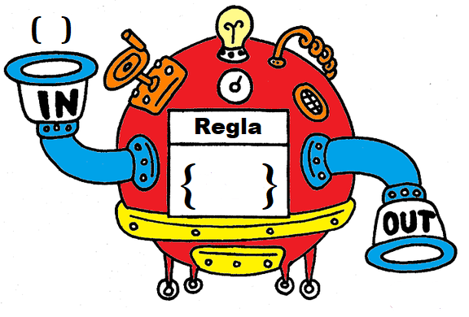

# Semana 3 (Condicionales 2)

## Objetivos

- Reforzar conocimientos en el uso de condicionales.
- Conocer el patrón de fallback con el else.
- Aplicar el uso y conocer el alcance y posibilidades al desarrollar if,else anidados.
- Conocer el uso del objeto Math y su implicancia en diversas operaciones de programación (acceder a elementos, números aleatorios, redondeos, etc)

## Operador === y ==

```javascript
1 == true
1 === true
```

## Operadores && y || 

Me sirven para combinar condiciones.

## if else

Agrego una segunda opcion a mis condiciones!

# Ejercicio

<p>Quiero una pagina que muestre una imagen dependiendo de la temperatura.
<ul>
<li>Polar temp < 0 </li>
<li>Frio  0 <  temp < 15 </li>
<li>Templado  15 < temp < 30 </li>
<li>Calido  30 < temp < 40 </li>
<li>Horno   temp > 40  </li>
</ul>

Polar:

 

Frio:

 

Templado:

 

Calido:

 

Horno:

 


## Funciones:


Armemos una maquina que reciba nuestro año de nacimiento y devuelva nuestra edad!

```javascript
function calculoEdad(anioNacimiento) {
return 2022-anioNacimiento
}
```





Podemos hacerla un poquito mas compleja:

```javascript
function calculoEdad(anioNacimiento) {
let edad = 2022-anioNacimiento
console.log('Tenes: '+ edad + ' años.')
return 
}
```


## Tipo de datos: 

Vimos numeros, strings y booleanos y ahora vemos
el cuarto tipo...los objetos!


```javascript
let cajamisteriosa
cajoneramisteriosa = { cajon1 : 23 , cajon2 : 'hola', cajon3 : false , cajon4 : calculoEdad} 
```


## Objeto Math:

Una cajonear (objeto) con valores y funciones matematicas super utiles!

```javascript
Math.PI
Math.round(3.14159)
Math.sqrt(25)
```
