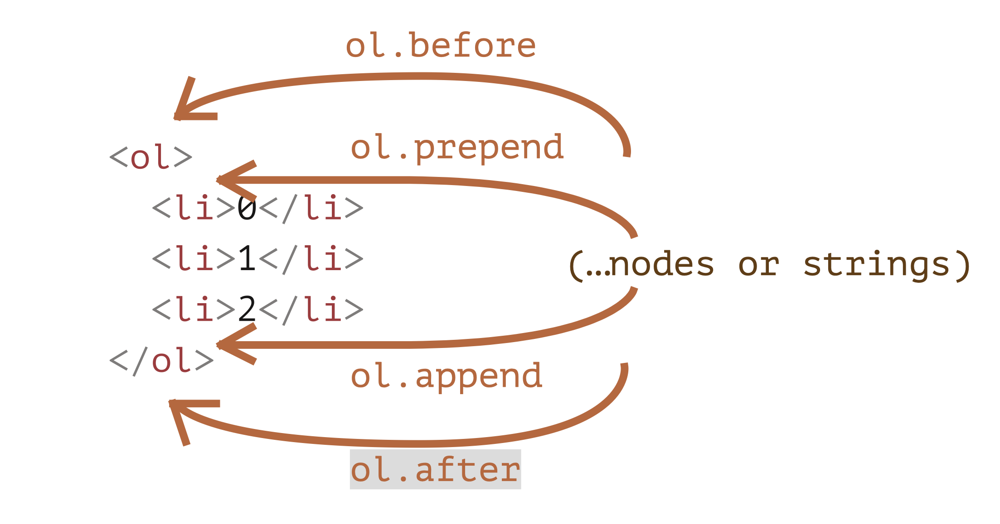

# Clase 2

## querySelectorAll

Devuelve una lista que coindicen con nuestra query

# getElementsby

## .getElementById

Permite buscar elementos por el ID, este metodo solo existe en el `document`:

```js
document.getElementById('test')
```

Javascript automaticamente crea variables para cada `id`:

Probemos en la consola llamar a la variable `test`:

```js
test
```


## .getElementsByTagName

Permite buscar elementos por el nombre de la etiqueta:

```js
document.getElementByTagName('div')
```

Esto me trae todos los divs.

## .getElementsByClassName

Permite buscar elementos por el nombre de la clase:

```js
document.getElementByClassName('footer')
```

Esto me trae todos los divs de la clase footer.

## Array o LiveCollection?:

Usemos `querySelectorAll` para traer todos los divs y tambien usemos `getElementsByTagName`. 

Deberian ser lo mismo...

```js
arr=document.querySelectorAll('div')
livecol=document.getElementsByTagName('div')
```

Agregamos un div:

```js
document.body.innerHTML+='<div> Hola, este div va al final! </div>'
```

Veamos ahora que paso con `arr` y con `livecol`.

`getElementsBy` devuelve una live collection, es decir una coleccion de los elementos que se actualiza constantemente.

# Resumen:

<table>
<thead>
<tr>
<td>Metodo</td>
<td>Busca usando...</td>
<td>Se puede usar en cualquier elemento?</td>
<td>En vivo?</td>
</tr>
</thead>
<tbody>
<tr>
<td><code>querySelector</code></td>
<td>CSS-selector</td>
<td>✔</td>
<td>-</td>
</tr>
<tr>
<td><code>querySelectorAll</code></td>
<td>CSS-selector</td>
<td>✔</td>
<td>-</td>
</tr>
<tr>
<td><code>getElementById</code></td>
<td><code>id</code></td>
<td>-</td>
<td>-</td>
</tr>
<tr>
<td><code>getElementsByTagName</code></td>
<td>tag or <code>'*'</code></td>
<td>✔</td>
<td>✔</td>
</tr>
<tr>
<td><code>getElementsByClassName</code></td>
<td>class</td>
<td>✔</td>
<td>✔</td>
</tr>
</tbody>
</table>

# Creando elementos:

Usando este metodo podemos crear nuevos elementos:

```js
nuevo_div=document.createElement('div')
```

Ahora podemos insertar texto:

```js
nuevo_div.innerText='Esto es nuevo texto!'
```

O incluso cualquier HTML:


```js
nuevo_div.innerHTML='<strong>Esto es nuevo texto!</strong>'
```

Pero este elemento, todavia no esta visible en nuestra pagina, tenemos que agregarlo en algun lugar.

Decidimos donde vamos a insertar nuestro nuevo elemento y podemos usar cualquiera de estos metodos. En nuestro ejemplo probemos insertarlo en el div de la clase `content`.


```js
div_cont=document.getElementsByClassName('content')[0]
```
Ahora probemos lo siguiente:

```js
div_cont.append(nuevo_div)
div_cont.prepend(nuevo_div)
div_cont.before(nuevo_div)
div_cont.after(nuevo_div)
```
Los metodoso append/prepend agregan al final o al principio del contenido de un elemento. before/after van por afuera del elemento



# Borrando elementos:

```js
elemento.remove()
```

